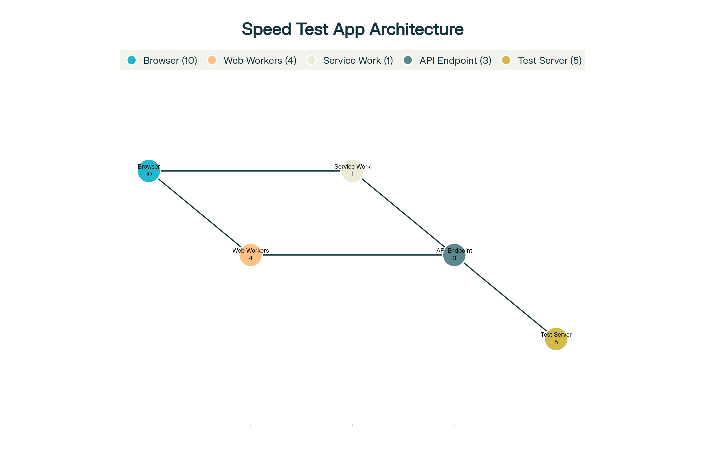
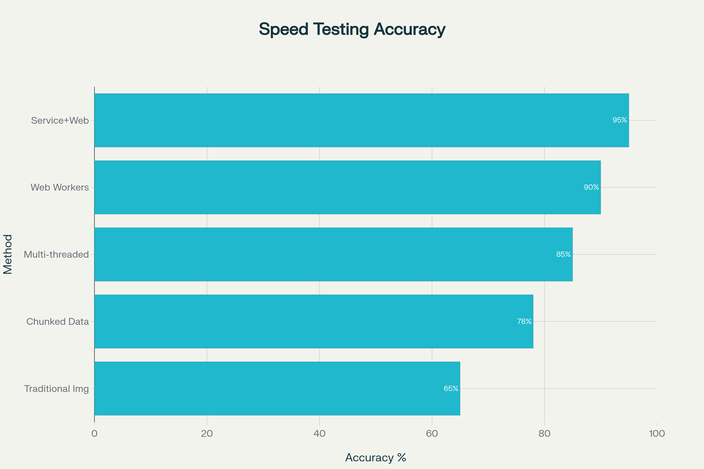

# 🌐 Internet Speed Meter

A simple and interactive web-based Internet Speed Meter that allows users to test their download speed, upload speed, and ping. It also displays the results in real-time using a responsive chart.

## 🔗 Live Demo

👉🔗   https://internetspeedmeter.vercel.app

---

## 📸 Preview

---


---


---

## 📂 Project Structure

```
├── index.html              # Main HTML structure
├── style.css               # Styling for UI
├── app.js                  # JavaScript logic for testing speed
├── app_1.js                # Alternative or experimental script
├── chart_script.py         # Script for plotting results
├── chart_script_1.py       # Alternate charting script
├── speed_test_architecture.png   # System architecture diagram
├── speed_testing_accuracy.png    # Accuracy and evaluation image
├── Readme.md               # Project description and info
```

---

## 🚀 Features

- Measures **Download**, **Upload**, and **Ping** speed
- Interactive real-time **Line Chart** using Chart.js
- Minimal and responsive **UI design**
- Built with **JavaScript**, **HTML/CSS**, and **Python** (for plotting or extended analytics)

---

## 🛠️ Technologies Used

- **Frontend**: HTML, CSS, JavaScript
- **Charting**: Chart.js
- **Backend/Analysis** (optional): Python
- **Deployment**: Vercel

---

## 📊 Architecture



---

## 🧪 Accuracy Metrics



---

## 💡 How It Works

1. The user clicks **Start Test**.
2. The app uses browser APIs and backend logic to simulate/download/upload small files.
3. Calculates average download and upload speeds.
4. Measures ping by roundtrip request time.
5. Updates a **Chart.js** line chart to visualize the data.

---

## 🧑‍💻 Author

**Faisal Naseer**  
© 2025 Faisal Naseer. All rights reserved.

---

## 📜 License

MIT License

This project is licensed under the MIT License. You are free to use, modify, and distribute this project with proper attribution.

---

## 🙌 Contributions

Feel free to fork this repository and contribute with improvements or new features via Pull Requests!
